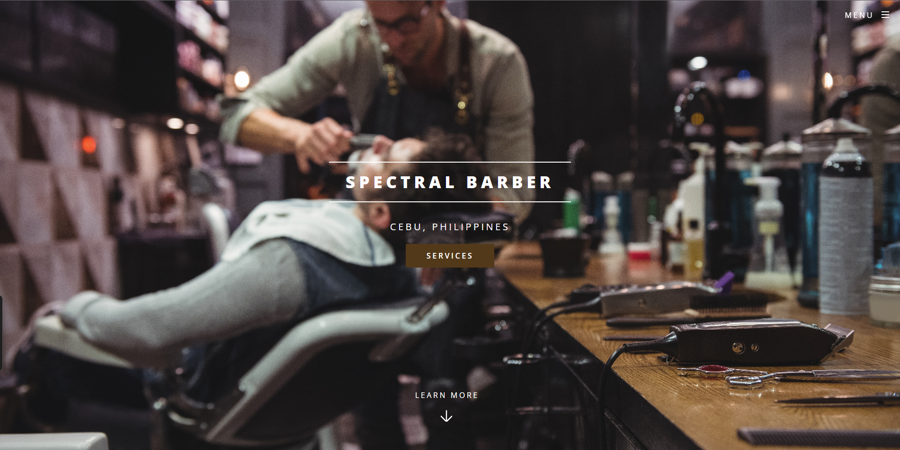
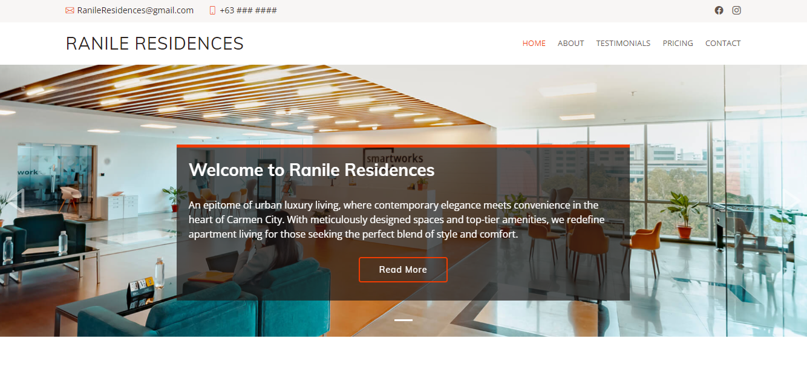
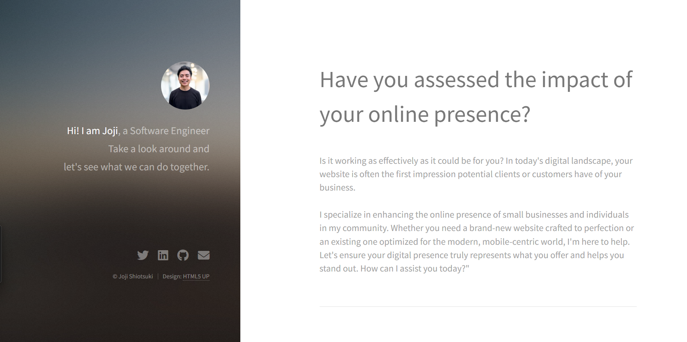
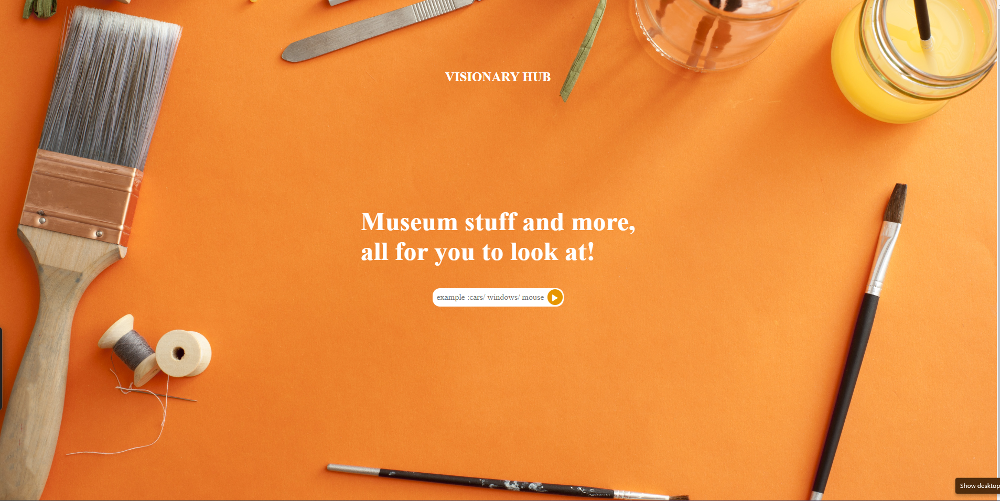

<h1 align="center">Hi 👋, I'm Joji Shiotsuki</h1>
<h3 align="center">Hi, im a Software Engineer at 100 Devs, I am looking for a position where i can affect positive change at scale and expand my knowledge in Software Engineering. I am currently focusing on Web Development - HTML, CSS, Javascript Opportunities, with a secondary focus on AI.</h3>

- 👨‍💻 All of my projects are available at [https://jojishiotsuki.netlify.app/](https://jojishiotsuki.netlify.app/)

- 📫 How to reach me **Shiotsuji0@gmail.com**

<h3 align="left">Connect with me:</h3>

<h3 align="left">Languages and Tools:</h3>

     

<h1 align="center">Projects</h1>
<table bordercolor="#66b2b2">
  
  <tr>
    <td width="50%" valign="top">
      <h3 align="center">Spectral Barber</h3>
         
        
         
        

			
			
      	

        
<strong>HTML5, CSS , Javascript, HTML5UP</strong> - A fully responsive, beautiful, and modern website for an on trend full-service barber

    </td>
    <td width="50%" valign="top">
      <h3 align="center">Ranile Residences</h3>
         
      
         
        

          
  
  
      

        
<strong>HTML5, CSS3, HTML5UP, Javascript</strong> - A sleek and inviting platform that elegantly presents the property's amenities and pricing, enticing visitors to learn more and take the next steps towards making it their home.

    </td>
  </tr>
  
  <tr>
    <td width="50%" valign="top">
      <h3 align="center">Portfolio</h3>
       
        
       
        

  
  
      

        
<strong>HTML5, CSS3, HTML5UP,  & Javascript</strong> - Portfolio Site including links to my projects and ways to get in contact with me.

    </td>
    <td width="50%" valign="top">
      <h3 align="center">Visionary Hub</h3>
         
        
         
        

          
  
  
      

        
<strong>HTML5, CSS3, & Javascript</strong> - Web application that can generate items, images and paintings from a API Database.

    </td>
  </tr>
</table>
