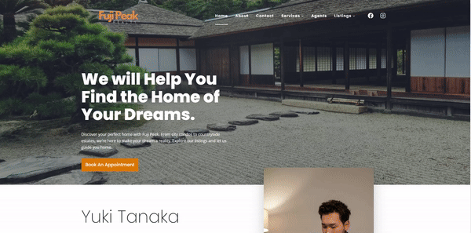
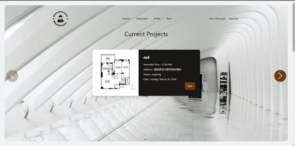

<h1 align="center">Hi 👋, I'm Joji Shiotsuki</h1>
<h3 align="center">Hi, im a Software Engineer, I am looking for a position where i can affect positive change at scale and expand my knowledge in Software Engineering. I am currently focusing on Web Development - Wordpress, HTML, CSS, Javascript, express.js, node.js and vue Opportunities, with a secondary focus on AI.</h3>

- 👨‍💻 All of my projects are available at [https://jojishiotsuki.netlify.app/](https://jojishiotsuki.netlify.app/)

- 📫 How to reach me **Shiotsuji0@gmail.com**

<h1 align="center">Projects</h1>
<table bordercolor="#66b2b2">
  <tr>
    <td width="50%" valign="top">
      <h3 align="center">Fuji Peak Realty</h3>
         
        
         
        

			
			
      	

        Username : mineral   Password : tremendous  
        
<strong>HTML5, CSS , Javascript, Wordpress</strong> - A full stack website for a real estate company capable of booking appointments with agents and browsing through latest postings.

    </td>
  </tr>
  <tr>
    <td width="50%" valign="top">
      <h3 align="center">Shiotsuki Interior</h3>
         
        
         
        

			
			
      	

        Email : test@gmail.com   Password : testtest123
        
<strong>HTML5, CSS , Javascript, Node.js, Express.js, Tailwind</strong> - A full stack website for a construction firm to add, update and see ongoing projects.

    </td>
  </tr>
  
  <tr>
    <td width="50%" valign="top">
      <h3 align="center">Portfolio</h3>
       
        
       
        

  
  
      

        
<strong>HTML5, CSS3, HTML5UP,  & Javascript</strong> - Portfolio Site including links to my projects and ways to get in contact with me.

    </td>
  </tr>
</table>

<h3 align="left">Languages and Tools:</h3>

 
   
   
   
   
   
   
   

